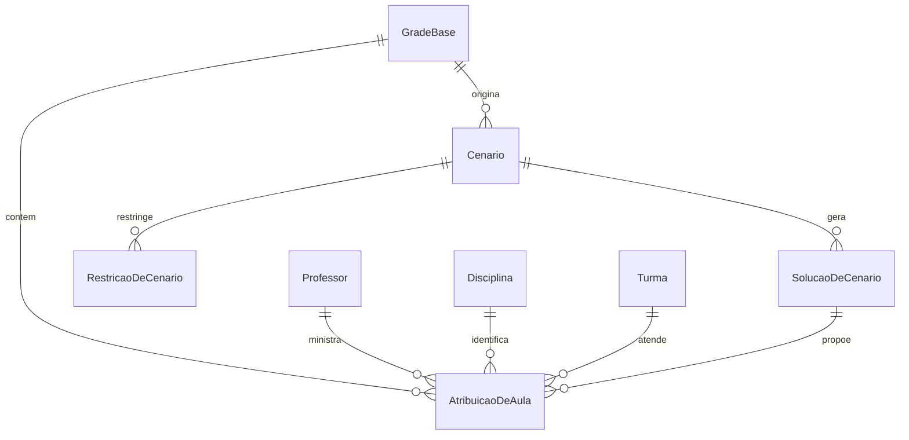

# Gerar cenários de reorganização da grade

## Problem

Hoje a equipe pedagógica reorganiza manualmente uma grade quando um professor fica indisponível. Não existe um mecanismo determinístico para testar alternativas que preservem a maior parte possível da grade e expliquem o impacto de cada alternativa.

O primeiro produto validável precisa provar que uma grade semanal já existente pode receber a ausência de um professor e produzir alternativas viáveis, comparáveis e reproduzíveis. A pesquisa não fornece um dataset público completo e confiável; portanto, este POC não depende das planilhas baixadas.

## Flow

O POC reutiliza a grade base como dado imutável e mantém o OR-Tools restrito ao módulo de scheduling, sem interface, importador ou banco de dados.

1. Uma `GradeBase` e um `Cenario` entram no módulo `cenarios` - o cenário referencia a grade e declara a indisponibilidade e as restrições de alteração.
2. `SchedulingEngine` (door 1) valida a coerência do cenário com a grade e cria a representação do problema para o solver.
3. `OrToolsSchedulingEngine` (door 1) constrói um `CpModel`, aplica as restrições obrigatórias, otimiza o impacto das alterações e coleta soluções distintas.
4. `ComparadorDeSolucoes` (door 1) compara cada solução com a grade base, calcula alterações e professores afetados e retorna até cinco alternativas ordenadas.
5. out: `ResultadoDaSimulacao`, contendo o status, a explicação de inviabilidade quando não houver solução e as soluções comparáveis; a `GradeBase` não é alterada.

## Impact

| Front | What changes |
| --- | --- |
| domain | new term: `GradeBase` - alocações vigentes que são a referência imutável de uma simulação. |
| domain | new term: `Cenario` - alteração hipotética e suas restrições, sempre vinculada a uma única `GradeBase`. |
| domain | new term: `SolucaoDeCenario` - proposta completa de alocações e o impacto calculado contra a `GradeBase`. |
| domain | new term: `AtribuicaoDeAula` - relação entre professor, disciplina, turma, dia e período que representa uma aula da grade. |
| stored data | nothing to migrate - o POC recebe objetos em memória e não persiste dados. |

## Relations

One-way constraints: uma `SolucaoDeCenario` referencia exatamente um `Cenario`; toda `AtribuicaoDeAula` proposta possui exatamente um professor, disciplina, turma, dia e período; uma solução não pode alterar a `GradeBase`.

## Surface

None - nothing consumed outside. O POC expõe uma interface Python interna; API HTTP, CLI e interface gráfica são posteriores.

## Landing

| One-way door | Literal shape | Alternative rejected |
| --- | --- | --- |
| motor de otimização | `SchedulingEngine` como porta de domínio e `OrToolsSchedulingEngine` como adaptador exclusivo do `ortools.sat.python.cp_model` | chamadas ao OR-Tools distribuídas pelos slices, porque acoplam o domínio à biblioteca e impedem troca ou isolamento futuro do solver. |
| identidade do cenário | `Cenario` mantém somente alterações e restrições sobre uma `GradeBase` imutável; `SolucaoDeCenario` é derivada e nunca substitui a grade | editar a grade vigente durante a simulação, porque destrói o comparativo e torna a aplicação de uma opção irreversível. |
| ordenação de soluções | tupla lexicográfica `(quantidadeDeAlteracoes, quantidadeDeProfessoresAfetados, quantidadeDeAulasDeslocadas, janelasCriadas)` | uma pontuação única com pesos configuráveis, porque pesos sem validação pedagógica ocultam prioridades e tornam o resultado difícil de explicar. |

- Nothing else in this change is hard to reverse.

## Criteria

### S1: modelar uma grade semanal e um cenário de ausência (P1)

O POC recebe dados sintéticos suficientes para representar 20 professores, 10 turmas, 10 disciplinas, cinco dias, seis períodos e entre 100 e 200 aulas.

**Acceptance Criteria**

1. The system SHALL representar cada aula da grade com exatamente um professor, uma disciplina, uma turma, um dia e um período.
2. WHEN um cenário declarar a ausência de um professor em uma janela de tempo THEN the system SHALL impedir que esse professor ministre uma aula dentro da janela declarada.
3. IF uma atribuição referenciar professor, turma, disciplina, dia ou período inexistente na grade base THEN the system SHALL rejeitar a simulação antes de invocar o solver.
4. IF um cenário restringir alterações a uma janela que não contém todas as aulas afetadas pela ausência THEN the system SHALL retornar o status `CENARIO_INVIAVEL` com as aulas afetadas que ficaram fora da janela.

**Independent test:** construir uma grade sintética válida, declarar a ausência de um professor em uma manhã e comprovar a validação dos cenários válidos e inválidos.

### S2: gerar alternativas viáveis com CP-SAT (P1)

O POC reorganiza somente as aulas permitidas pelo cenário e mantém as regras pedagógicas mínimas.

**Acceptance Criteria**

5. WHEN um cenário válido for simulado THEN the system SHALL produzir soluções nas quais nenhum professor e nenhuma turma tenham duas aulas no mesmo dia e período.
6. The system SHALL atribuir uma aula somente a professor habilitado para sua disciplina e disponível no dia e período propostos.
7. The system SHALL preservar a quantidade total de aulas de cada combinação turma e disciplina existente na grade base.
8. WHILE uma aula estiver fora da janela de alteração do cenário THEN the system SHALL preservar seu professor, disciplina, turma, dia e período originais.
9. IF as restrições obrigatórias não puderem ser satisfeitas THEN the system SHALL retornar `CENARIO_INVIAVEL` sem retornar uma solução parcial como viável.

**Independent test:** simular a ausência de um professor para uma grade com substitutos habilitados e confirmar que toda solução respeita conflitos, habilitações, disponibilidade e carga da turma.

### S3: comparar e explicar opções de reorganização (P1)

O POC apresenta alternativas distintas para que a equipe pedagógica escolha uma delas sem uma decisão automática opaca.

**Acceptance Criteria**

10. WHEN houver ao menos uma solução viável THEN the system SHALL retornar no máximo cinco soluções estruturalmente distintas.
11. The system SHALL informar em cada solução a quantidade de alterações, os professores afetados, as aulas deslocadas e as janelas criadas em comparação com a grade base.
12. WHEN duas soluções forem retornadas THEN the system SHALL ordená-las por menos alterações, menos professores afetados, menos aulas deslocadas e menos janelas criadas, nessa ordem.
13. WHEN uma simulação com a mesma grade base e o mesmo cenário for executada novamente THEN the system SHALL retornar soluções na mesma ordem.

**Independent test:** executar duas vezes o mesmo cenário que tenha múltiplas alternativas e conferir o limite, a distinção, os indicadores e a ordem estável.

## Out of scope

| Excluded | Why |
| --- | --- |
| importação de Excel, CSV, Google Sheets, PDF ou Word | a pesquisa mostrou que os arquivos públicos não têm o modelo necessário; o POC usará dados sintéticos controlados. |
| persistência em PostgreSQL | o objetivo inicial é validar o motor isolado, sem acoplar a experimentação à infraestrutura. |
| API HTTP, autenticação e interface React | o POC é uma biblioteca Python chamada por testes e fixtures. |
| aplicação de uma solução à grade oficial | a escolha e a persistência da solução pertencem a uma etapa posterior. |
| substituição por regras de habilitação da SEED/NRE | a fonte normativa e o dataset real ainda não foram definidos; o POC recebe habilitações explícitas. |
| preferências, salas, laboratórios, aulas geminadas e bloqueios pedagógicos avançados | são restrições incrementais depois da validação das restrições mínimas. |
| IA como decisora de grade | a IA poderá futuramente estruturar pedidos; a otimização permanece determinística no OR-Tools. |

## Assumptions

| Assumption | Chosen default | Rationale | Confirmed? |
| --- | --- | --- | --- |
| forma de execução do POC | biblioteca Python sem API HTTP nem persistência | o usuário definiu um POC de Scheduling Engine isolado. | y |
| arquitetura da aplicação futura | monólito modular com vertical slices | o usuário definiu essa arquitetura para evoluir o POC sem microserviços. | y |
| solver | OR-Tools CP-SAT pela biblioteca Python `ortools` | o documento recomenda Python para otimização e OR-Tools. | y |
| origem dos dados iniciais | fixtures sintéticas anonimizadas | os arquivos públicos pesquisados não atendem ao modelo mínimo necessário. | y |
| escopo do primeiro cenário | ausência de um professor em uma janela temporal | é o caso de uso central definido no documento e permite validar a reorganização dinâmica. | y |
| modelo de substituição | professores habilitados e disponíveis são fornecidos explicitamente na grade base | regras oficiais de habilitação ainda não foram validadas para o produto. | n |
| limite de execução do solver | 10 segundos por simulação | impede que o POC bloqueie indefinidamente; o limite será reavaliado com uma escola real. | n |

**Open questions:** none - all unresolved choices estão registradas como pressupostos para revisão antes dos checks.

## Observable

| Surface | Decision | Landing |
| --- | --- | --- |
| biblioteca Python `SchedulingEngine.simular` | sucesso, inviabilidade e erro de validação | AC 2, AC 3, AC 4, AC 9 |
| biblioteca Python `SchedulingEngine.simular` | formato de soluções e métricas comparativas | AC 10, AC 11, AC 12, AC 13 |
| API HTTP | versionamento, autorização, rate limit e formato de erro | n/a - o POC não expõe rede. |
| interface gráfica | estados vazio, carregamento, erro, não autorizado e confirmação destrutiva | n/a - o POC não possui interface gráfica. |
| comando ou tarefa agendada | flags, saída e códigos de saída | n/a - o POC não expõe CLI nem tarefa agendada. |

## Sources

- `docs/agenda_escolar_parana_pesquisa_e_arquitetura.md` - objetivo do produto, POC, arquitetura modular, OR-Tools e regras de simulação.
- Resposta do usuário de 19/09/2026 - monólito modular com vertical slices e POC isolado do Scheduling Engine com OR-Tools.
