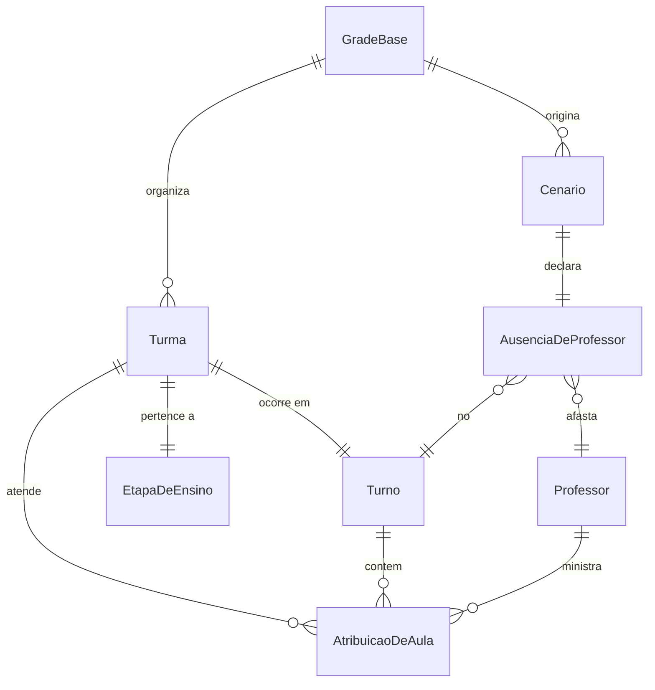

# Turnos e ausência por professor e turno

## Problem

A equipe pedagógica declara a falta de um professor pelo turno em que ele não estará, e a quantidade de aulas desse turno depende da etapa da turma: cinco no ensino fundamental e seis no ensino médio, em manhã, tarde e noite.

Hoje o POC trata o dia como uma sequência única de períodos 1 a 6 e a ausência como uma lista solta de pares dia e período. Isso impede representar os três turnos, impede distinguir fundamental de médio e força a equipe a traduzir “faltou de manhã” em slots inventados. Quem monta o cenário paga o custo de errar a janela e de misturar aulas da tarde numa falta da manhã.

O que muda quando isto existir: um cenário nomeia o professor e o turno da falta; o motor só mexe nas aulas daquele turno e respeita 5 ou 6 períodos conforme a etapa da turma.

## Flow

Reusa `SchedulingEngine`, `OrToolsSchedulingEngine`, `ComparadorDeSolucoes` e a validação já existentes no módulo `cenarios`; não cria um segundo solver nem uma segunda comparação.

1. Uma `GradeBase` com turmas que já carregam etapa e turno, e um `Cenario` com ausência de professor e turno, entram no módulo `cenarios` (exists).
2. `SchedulingEngine` (exists, door 1 de gerar-cenarios-grade) valida etapa, turno, quantidade de períodos e a ausência; rejeita referências inválidas antes do solver.
3. `OrToolsSchedulingEngine` (exists) restringe a reorganização ao turno da ausência e coleta soluções viáveis.
4. `ComparadorDeSolucoes` (exists) compara as soluções com a `GradeBase` imutável e devolve até cinco alternativas ordenadas.
5. out: `ResultadoDaSimulacao` com `CENARIO_VIAVEL`, `CENARIO_INVIAVEL` ou `ERRO_VALIDACAO`; a `GradeBase` não é alterada.

## Impact

| Front | What changes |
| --- | --- |
| domain | new term: `Turno` - um dos três blocos do dia letivo: `MANHA`, `TARDE` ou `NOITE`. |
| domain | new term: `EtapaDeEnsino` - `FUNDAMENTAL` ou `MEDIO`, e é ela que fixa quantos períodos o turno da turma tem. |
| domain | existing term: `periodo` deixou de ser um índice global do dia (1 a 6) e passa a ser a ordem da aula dentro do turno da turma - `referencias_da_grade_sao_validas`, o adaptador CP-SAT e `dados/grade-basica.json` ramificam nisso hoje. |
| domain | existing term: `AusenciaDeProfessor` deixou de ser uma lista de pares dia e período e passa a ser o professor e o turno da falta - `Cenario` e `aulas_afetadas_pela_ausencia` ramificam nisso hoje. |
| stored data | nothing to migrate - o POC continua em memória; o dataset sintético será reescrito, não há base persistida. |

## Relations

One-way constraints: cada `Turma` ocorre em exatamente um `Turno` e pertence a exatamente uma `EtapaDeEnsino`; a quantidade de períodos de um turno é 5 quando a etapa é `FUNDAMENTAL` e 6 quando a etapa é `MEDIO`; uma `AusenciaDeProfessor` referencia exatamente um professor e exatamente um turno; uma aula herda o turno da sua turma e não pode declará-lo diferente; uma solução não altera a `GradeBase`.

## Surface

None - nothing consumed outside. O POC permanece biblioteca Python; `SchedulingEngine.simular` continua sendo a única chamada, agora com `Cenario` em termos de professor e turno.

## Landing

| One-way door | Literal shape | Alternative rejected |
| --- | --- | --- |
| período relativo ao turno e à etapa | o período é a ordem da aula dentro do turno da turma; o teto é 5 se a etapa for `FUNDAMENTAL` e 6 se for `MEDIO`; os turnos válidos são `MANHA`, `TARDE` e `NOITE` | manter um período global 1 a 6 no dia, porque não expressa três turnos nem as duas cargas (5 e 6) ao mesmo tempo. |
| ausência por professor e turno | `AusenciaDeProfessor` declara `idProfessor` e `turno`; os slots afetados são todas as aulas daquele professor naquele turno nos dias cobertos | continuar exigindo só uma lista de pares dia e período, porque o pedido pedagógico é “faltou neste turno”, não um conjunto de horários avulsos. |
| janela padrão igual ao turno da falta | sem restrição extra, a janela de alteração é o próprio turno da ausência; aulas de outros turnos ficam fixas | deixar a janela como lista independente de slots, porque uma falta da manhã poderia reescrever a tarde sem o usuário ter pedido. |

- Nothing else in this change is hard to reverse.

## Criteria

### S1: modelar turno, etapa e carga de períodos (P1)

A grade passa a saber em que turno a turma vive e quantas aulas aquele turno comporta.

**Acceptance Criteria**

1. The system SHALL associar cada turma a exatamente um turno entre `MANHA`, `TARDE` e `NOITE`.
2. The system SHALL associar cada turma a exatamente uma etapa entre `FUNDAMENTAL` e `MEDIO`.
3. The system SHALL aceitar no máximo 5 períodos para turma `FUNDAMENTAL` e no máximo 6 períodos para turma `MEDIO`, contados dentro do turno da turma.
4. IF uma aula usar período acima do teto da etapa da sua turma, ou um turno diferente do turno da sua turma, THEN the system SHALL rejeitar a simulação com `ERRO_VALIDACAO` antes de criar o modelo CP-SAT.

**Independent test:** montar uma grade com turma fundamental de manhã (5 períodos) e turma de médio à tarde (6 períodos) e rejeitar uma aula com período 6 no fundamental ou com turno distinto da turma.

### S2: declarar falta pelo professor e pelo turno (P1)

O cenário deixa de ser uma janela de horários soltos e passa a ser a falta de um professor em um turno.

**Acceptance Criteria**

5. WHEN um cenário declarar a ausência de um professor em um turno THEN the system SHALL impedir que esse professor permaneça alocado em qualquer aula daquele turno nos dias cobertos pelo cenário.
6. WHEN um cenário declarar professor e turno THEN the system SHALL usar esse turno como janela padrão de alteração e preservar professor, disciplina, turma, dia e período de toda aula cujo turno seja outro.
7. IF o turno ou o professor da ausência não existir na grade base THEN the system SHALL retornar `ERRO_VALIDACAO` antes de invocar o solver.
8. IF o professor ausente não tiver aula no turno declarado nos dias cobertos THEN the system SHALL retornar `CENARIO_VIAVEL` com a grade base inalterada e zero alterações.

**Independent test:** declarar Ana ausente em `MANHA`, confirmar que ela some das aulas da manhã, que as aulas da tarde e da noite não mudam, e que um turno ou professor inexistente cai em `ERRO_VALIDACAO`.

## Out of scope

| Excluded | Why |
| --- | --- |
| horários de relógio (07:30, 13:10) e duração de aula | o POC continua em períodos ordinais; o relógio é uma camada posterior. |
| turma em dois turnos no mesmo dia | a unidade pedagógica aqui é uma turma em um turno; dobradinha seria outro produto. |
| calendário de dias letivos, feriados e falta em uma data isolada fora da semana modelo | a grade continua semanal; o dia, quando informado, é 1 a 5. |
| API HTTP, interface gráfica e persistência | o POC permanece biblioteca Python. |
| regras oficiais de habilitação SEED/NRE | as habilitações continuam explícitas na grade. |

## Assumptions

| Assumption | Chosen default | Rationale | Confirmed? |
| --- | --- | --- | --- |
| dias cobertos pela ausência | se o cenário omitir dias, a falta vale para todos os dias letivos da grade naquele turno; se informar `dias`, só aqueles | o pedido nomeou professor e turno, não a data; exigir dia tornaria o caso “afastamento da manhã a semana toda” mais verboso | y |
| escola mista na mesma `GradeBase` | permitido: cada turma traz a própria etapa e o próprio turno | fundamental e médio convivem na mesma escola e o teto de períodos é da turma, não da escola | y |
| professor em mais de um turno | permitido; a falta em um turno não o remove dos outros | é o caso real de quem tem manhã e tarde | y |
| restrição `JANELA_DE_ALTERACAO` explícita | continua aceita; se vier, precisa cobrir as aulas afetadas, senão `CENARIO_INVIAVEL` como hoje | não jogamos fora a restrição já verificada; só mudamos o padrão quando ela não vem | y |

**Open questions:** none - os pontos em aberto estão na tabela, com default, para você confirmar ou corrigir na revisão do plano.

## Observable

| Surface | Decision | Landing |
| --- | --- | --- |
| biblioteca Python `SchedulingEngine.simular` | validação de turno, etapa e teto de período | AC 1, AC 2, AC 3, AC 4, AC 7 |
| biblioteca Python `SchedulingEngine.simular` | ausência por professor e turno e preservação dos demais turnos | AC 5, AC 6, AC 8 |
| comando `python -m gradeia` | dataset JSON passa a descrever turma com turno e etapa, e cenário com professor e turno | existing - o comando já existe e só muda o arquivo que carrega; códigos de saída permanecem 0 para viável ou inviável e 1 para erro de arquivo ou validação. |
| API HTTP | versionamento, autorização, rate limit e formato de erro | n/a - o POC não expõe rede. |
| interface gráfica | estados vazio, carregamento, erro, não autorizado e confirmação destrutiva | n/a - o POC não possui interface gráfica. |

## Sources

- Pedido do usuário de 19/09/2026 - turnos manhã, tarde e noite; 5 períodos no fundamental e 6 no médio; cenário pelo professor e pelo turno da falta.
- `.specs/features/gerar-cenarios-grade/plan.md` - motor isolado, `GradeBase` imutável, OR-Tools só no adaptador e ordenação lexicográfica, todos reusados.
